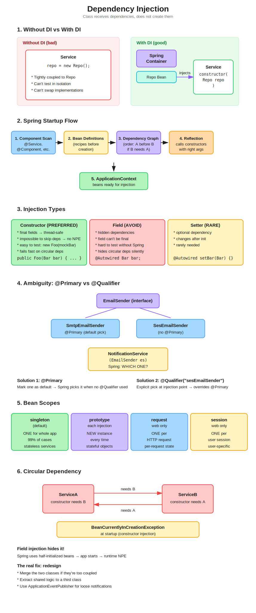

# Dependency Injection (DI)



---

## TL;DR

- **DI** = class **receives** its dependencies, doesn't `new` them itself
- **IoC** = something else (Spring) controls the wiring
- **Use constructor injection.** Avoid field injection.
- Ambiguity? `@Primary` for defaults, `@Qualifier` for overrides
- Default scope is `singleton` — leave it unless you have a reason

---

## 1. Why DI

### Without DI
```java
public class Service {
    private Repo repo = new Repo();   // creates its own dependency
}
```
Problems:
- Tightly coupled to `Repo`
- Can't swap for tests (mock)
- Caller has to know how to build `Repo`

### With DI
```java
public class Service {
    private final Repo repo;
    public Service(Repo repo) {       // receives dependency
        this.repo = repo;
    }
}
```
- Works with any `Repo` implementation
- Pass a mock in tests → `new Service(mockRepo)`
- Spring wires it at runtime

---

## 2. Spring Startup Flow

1. **Component Scan** — finds classes annotated with `@Component`, `@Service`, `@Repository`, `@RestController`, `@Configuration`
2. **Bean Definitions** — creates a recipe for each (class, scope, required deps)
3. **Dependency Graph** — figures out creation order (A before B if B needs A)
4. **Reflection** — calls constructors with the right already-created beans
5. **ApplicationContext** — all beans stored, ready for injection

---

## 3. Three Ways to Inject

### Constructor — PREFERRED
```java
@Service
public class Foo {
    private final Bar bar;
    public Foo(Bar bar) { this.bar = bar; }
}
```
**Why:**
- Fields are `final` → immutable, thread-safe
- Impossible to create without deps → no NPE
- Easy to test without Spring
- Circular deps fail loud at startup

### Field — AVOID
```java
@Autowired private Bar bar;
```
- Hidden deps, can't be `final`, hard to test, hides circular deps silently

### Setter — RARE
```java
@Autowired public void setBar(Bar bar) { this.bar = bar; }
```
Only for optional or mutable dependencies.

---

## 4. Ambiguity: Multiple Beans of Same Type

```java
@Service class SmtpEmailSender implements EmailSender { }
@Service class SesEmailSender implements EmailSender { }

@Service class NotificationService {
    NotificationService(EmailSender es) { }   // which one?
}
```
→ `NoUniqueBeanDefinitionException` at startup.

### Fix 1: `@Primary` (default pick)
```java
@Service
@Primary
class SmtpEmailSender implements EmailSender { }
```

### Fix 2: `@Qualifier` (explicit pick)
```java
NotificationService(@Qualifier("sesEmailSender") EmailSender es) { }
```

**Use `@Primary` for the default, `@Qualifier` to override at specific places.**

---

## 5. Bean Scopes

| Scope | Instances | Use |
|---|---|---|
| `singleton` (default) | One per app | Stateless services (99% of cases) |
| `prototype` | New each injection | Stateful throw-away objects |
| `request` | One per HTTP request | Per-request state (web only) |
| `session` | One per user session | User-specific state (web only) |

**Gotcha:** injecting `prototype` into `singleton` still gives you one instance — the singleton is wired once at startup. Use `ObjectProvider` if you need a fresh prototype per call.

---

## 6. Circular Dependency

```java
@Service class A { A(B b) { } }
@Service class B { B(A a) { } }   // chicken and egg
```

**Constructor injection:** fails at startup with `BeanCurrentlyInCreationException`. Good — forces you to fix it.

**Field injection:** silently "works" with half-initialized beans → runtime NPE later. Hidden bug.

**Fix:** it's a design problem.
- Merge the two classes
- Extract shared logic into a third class
- Use `ApplicationEventPublisher` if one just needs to notify the other

---

## 7. @Bean — Manual Bean Declaration

Use when:
- Third-party classes (e.g., `ObjectMapper`) — you can't add `@Component` to library code
- Complex construction — custom config, reads properties, depends on other beans
- Multiple instances — two different configs of the same type

```java
@Configuration
public class AppConfig {

    @Bean
    public ObjectMapper objectMapper() {
        ObjectMapper mapper = new ObjectMapper();
        mapper.registerModule(new JavaTimeModule());
        return mapper;
    }
}
```

- Method name = bean name (`objectMapper`)
- `@Bean` methods can inject other beans as parameters:
```java
@Bean
public EmailService emailService(ObjectMapper mapper) {
    return new EmailService(mapper);
}
```

---

## 8. @ConditionalOnMissingBean — How Spring Boot Auto-Config Works

Spring Boot uses **conditional beans** to give you sensible defaults that you can override.

```java
@Bean
@ConditionalOnMissingBean(StringRedisTemplate.class)
public StringRedisTemplate stringRedisTemplate(RedisConnectionFactory f) {
    return new StringRedisTemplate(f);
}
```

"Create this bean **only if nobody else has defined one of this type.**"

- You don't define one → Spring Boot creates it
- You override it with your own → Spring Boot's version is skipped

This is why Spring Boot "just works" but stays out of your way when you need custom behavior.

### Common Conditionals

| Annotation | When it activates |
|---|---|
| `@ConditionalOnMissingBean` | No bean of this type exists |
| `@ConditionalOnBean` | A bean of this type exists |
| `@ConditionalOnClass` | A class is on the classpath |
| `@ConditionalOnMissingClass` | A class is NOT on the classpath |
| `@ConditionalOnProperty` | A property is set (e.g., `feature.x.enabled=true`) |
| `@ConditionalOnWebApplication` | Running as a web app |
| `@Profile("dev")` | Specific profile active |

---

## Annotations Cheat Sheet

| Annotation | Purpose |
|---|---|
| `@Component` | Generic Spring-managed bean |
| `@Service` | Business logic (alias for @Component) |
| `@Repository` | Data access (adds DB exception translation) |
| `@Controller` | MVC controller (returns views) |
| `@RestController` | = `@Controller` + `@ResponseBody` |
| `@Configuration` | Class contains `@Bean` methods |
| `@Bean` | Manually declare a bean (for classes you don't own) |
| `@Autowired` | Inject (optional on constructors since Spring 4.3) |
| `@Primary` | Default pick among multiple candidates |
| `@Qualifier("name")` | Pick specific bean by name |
| `@Scope("prototype")` | Override default singleton |